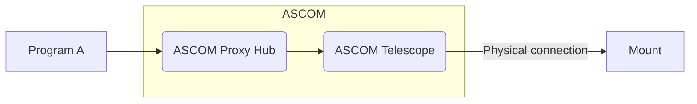
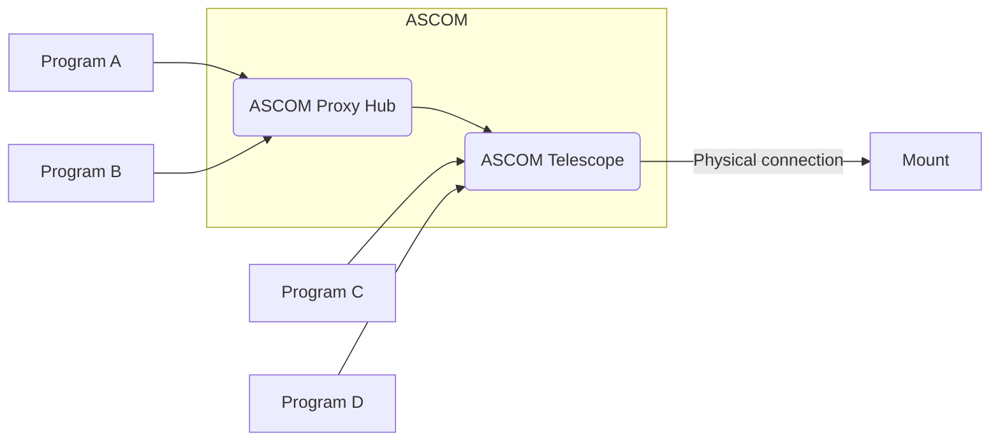

# ASCOM Telescope Proxy Hub

## Introduction
This is a 
* ASCOM Telescope Server which connects to another ASCOM Telescope driver.

The purpose of this server is to make obsolete drivers working again. Made especially for ASA DDM legacy mounts.

## Features
* This driver implementats a virtual ASCOM Telescope V3 driver and passes the calls to the original driver.
* Properties which are missing in the original driver are simulated in virtual driver.
* The driver is able to connect to the original driver via COM or TCP/IP (Alpaca)
  

The standard use case is to connect to the ASCOM Telescope Proxy Hub with a program which is not able to connect to the original ASCOM Telescope driver.

You can also connect multi programs to the Proxy Hub and to the orignal driver at the same time!

## Installation

Download the latest release from [here](https://github.com/photon1503/ASCOMProxyHub/releases/latest) and run the installer.

## Usage

1. In your client application, select "ASCOM Proxy Hub" as telescope driver and click "Properties".

2. In ASCOM Proxy Hub configuration, select your original telescope driver.

## TODO
[ ] Add Slew settle time to UI and Property
